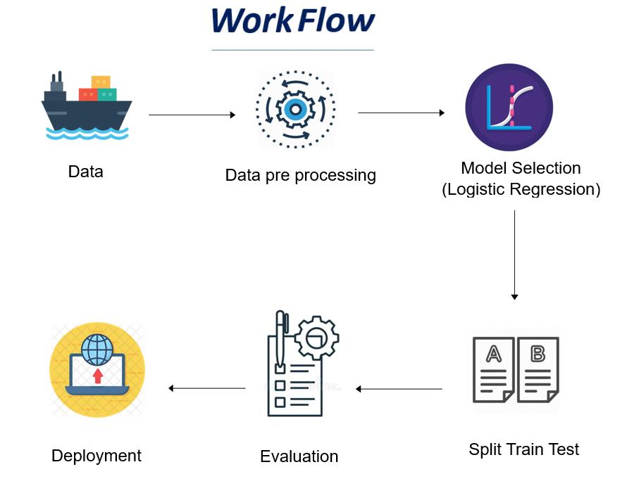
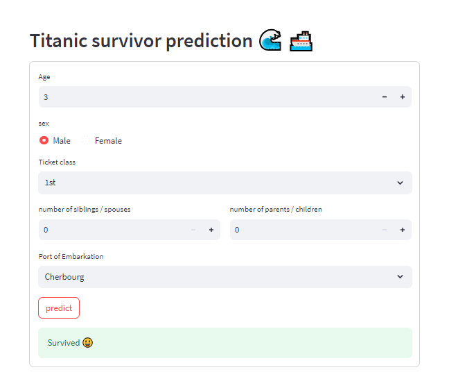

# Classification with Logistic Regression - Titanic

---

# Table of Contents

---

- [Project Overview](#project-overview)
- [Architecture](#architecture)
- [Usage - Making Predictions with Streamlit](#usage---making-predictions-with-streamlit)
- [Acknowledgments](#acknowledgments)
- [Authors](#authors)

---
# Project Overview

The project focuses on the application of the `logistic regression` algorithm to solve the Titanic classification problem. The Titanic dataset contains information about passengers, including whether they survived or not, and various features such as age, sex, ticket class, and more. The goal is to build a predictive model using logistic regression to classify passengers as survivors or non-survivors based on their characteristics.

# Architecture 

In this project we follow the architecture below :

---
 
---

### Dataset
The project uses the Titanic dataset, which includes information about passengers from the infamous Titanic ship. The dataset consists of both numerical and categorical features, making it suitable for logistic regression modeling.the dataset is provided by `Kaggle`.

### Feature Engineering
Before training the logistic regression model, we perform feature engineering to preprocess the data. This involves handling missing values, encoding categorical variables, to enhance the model's performance.

### Logistic Regression Model
The core of the project lies in implementing the logistic regression algorithm `from scratch`. We use mathematical techniques to create a custom logistic regression model without relying on pre-built libraries. 

### Performance Evaluation
After training the logistic regression model, we evaluate its performance . This step ensures that we can assess how well the model performs in classifying passengers accurately.

Since the project is part of the Titanic Kaggle competition, this step is done automatically right after submission .Our own trained model got a precision score of `0.74641`.

### Deployment 
After training and evaluating the logistic regression model, we proceed to deploy it for practical use. We utilize `Streamlit` framework to create an interactive web application that allows users to input passenger details and receive predictions on survival status.

to see other details like data pre-processing steps ,how we implemented the algorithm and how to use it in our case and also how the model is **exported** as a file to be reusable, consult the kaggle notebook, here is the link <a href="https://www.kaggle.com/code/ossamaoutmani/titanic-competition/notebook">Click here</a>

# Usage - Making Predictions with Streamlit
We demonstrate how to utilize the deployed logistic regression model using Streamlit in `titanicApp.py` file. Users can input passenger details through a user-friendly interface and get predictions on their survival status.

### The UI :
---
 
---

So to make predictions, consult the following link <a href="https://bit.ly/Titanic_survival">Click here</a>  then provide the data and finally see the result, or watch the demo video which is shared in `linkedin` platform, here is the link <a href="">Click here</a>

---

# Acknowledgments

We extend our sincere gratitude to `Kaggle` for providing the Titanic dataset, which forms the foundation of this project. The dataset has been instrumental in enabling us to explore and develop the logistic regression classification model for predicting passenger survival on the Titanic.

We would also like to express our thanks to the creators and maintainers of the `Streamlit` framework for their comprehensive and user-friendly documentation. The Streamlit framework has been crucial in helping us deploy our logistic regression model as an interactive web application, making it accessible to a wider audience.

Feel free to customize the content and functionality of this application according to your specific requirements. You can modify the user interface, add additional features, or integrate it with other systems.

---
# Authors
<a href="https://www.linkedin.com/in/aymane-maghouti/" target="_blank">Aymane Maghouti</a> 
<a href="https://www.linkedin.com/in/ossama-outmani/" target="_blank">Ossama Outmani</a> 
<a href="#" target="_blank">Elgharbaoui Abdelghafor</a>
